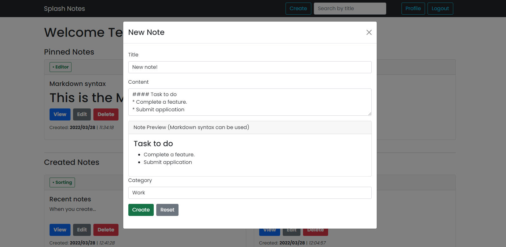

# TO DO Notes App -

### This is a complete Full Stack MERN application.

### Tech Stack -

- ReactJs - Javascript library
- React Bootstrap - UI styling
- Redux Toolkit - For managing and centralizing application state.
- React Router Dom - Routing/ redirecting of all pages

### Backend -

NodeJs + ExpressJs + MongoDb

**[Repository](https://github.com/adidoshi/todo-list_backend) | [Postman Doc](https://documenter.getpostman.com/view/15329989/UVCCdiWt)**

---

### Functionality-

- Complete user authentiation using JWT Auth Token, Forkmik & yup for form validations.

- User can create a note which includes content with **Markdown** syntax feature.

- Update / delete / view a note.

- User profile page to update user details + avatar.
